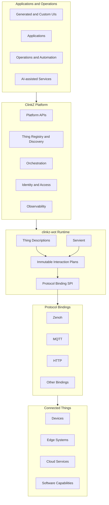
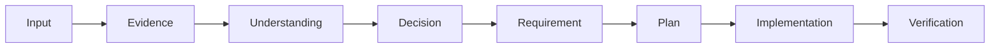

<div align="center">

# ClinkZ

### Simple Links. Infinite Possibilities.

**A Web of Things platform for connecting devices, edge systems, cloud services, applications, and software capabilities through one unified model.**

[](LICENSE)
[](https://www.w3.org/WoT/)
[](https://github.com/yushun1990/clinkz-wot)
[](#project-status)

[Vision](#vision) ·
[Architecture](#architecture) ·
[Repository](#repository-structure) ·
[Development Method](#development-method) ·
[Status](#project-status) ·
[Contributing](#contributing)

</div>

---

## Overview

ClinkZ is an open-source platform built around the
[W3C Web of Things](https://www.w3.org/WoT/) model.

It provides a protocol-independent foundation for exposing devices, services,
data sources, edge workloads, cloud applications, and software capabilities as
interoperable **Things**.

Instead of making applications depend directly on MQTT topics, HTTP endpoints,
Zenoh keys, or device-specific protocols, ClinkZ describes capabilities through
**Thing Descriptions** and leaves transport details to protocol bindings.

```text
Describe capabilities once.
Connect them through different protocols.
Use them across edge and cloud environments.
```

> [!IMPORTANT]
> ClinkZ is currently in its architecture and foundation phase. This README
> describes the project direction without presenting planned capabilities as
> completed features.

## Vision

Traditional IoT systems often couple application logic to device protocols,
transport-specific data models, and platform internals.

Those dependencies make systems harder to integrate, evolve, test, and reuse.

ClinkZ takes a different approach.

### Everything is a Thing

Physical devices, virtual devices, services, data sources, applications, and
software capabilities use a shared interaction model.

### Capabilities over protocols

Applications consume properties, actions, and events instead of depending on
MQTT, Zenoh, HTTP, or another transport directly.

### Thing Descriptions are contracts

W3C WoT Thing Descriptions declaratively define a Thing's capabilities,
interactions, data schemas, security metadata, and protocol forms.

### Edge and cloud form one system

The same semantic model should remain usable across constrained devices, local
edge systems, gateways, data centers, and cloud services.

### Architecture stays replaceable

Transport, deployment, storage, user interface, and orchestration mechanisms
should evolve without redefining the meaning of a Thing.

## Architecture

ClinkZ is the platform layer built on top of
[`clinkz-wot`](https://github.com/yushun1990/clinkz-wot), a protocol-neutral
Rust Web of Things runtime.



The responsibilities are intentionally separated:

| Layer                 | Responsibility                                                                |
| --------------------- | ----------------------------------------------------------------------------- |
| **ClinkZ**            | Platform services, applications, operations, deployment, and user experience  |
| **clinkz-wot**        | Protocol-neutral WoT semantics, planning, orchestration, and runtime behavior |
| **Protocol bindings** | Protocol syntax, transport I/O, correlation, and protocol-local state         |
| **Things**            | Devices, services, systems, data, and software capabilities                   |

Zenoh is the first concrete protocol binding implemented by `clinkz-wot`.
Additional bindings can be composed without changing the protocol-neutral
interaction model.

## Why ClinkZ?

ClinkZ is being designed to provide:

* **A unified capability model** for devices, services, and software
* **Protocol-independent applications** built on WoT interactions
* **Explicit semantic contracts** through W3C Thing Descriptions
* **Reusable edge and cloud components** with consistent behavior
* **Replaceable protocol bindings** rather than transport-locked business logic
* **Traceable architecture decisions** from evidence to implementation
* **A foundation for generated experiences**, automation, and AI integration

These are architectural goals. Individual platform features will be admitted
only after their requirements and boundaries have been accepted.

## Relationship to `clinkz-wot`

[`clinkz-wot`](https://github.com/yushun1990/clinkz-wot) is the runtime
foundation of the ClinkZ ecosystem.

It is responsible for:

* W3C WoT Thing Description and Thing Model contracts
* protocol-neutral properties, actions, and events
* immutable interaction planning
* Servient orchestration and lifecycle management
* Protocol Binding authoring contracts
* bounded execution across host and constrained environments
* Zenoh and future protocol integrations

ClinkZ builds platform-level capabilities around that runtime, rather than
duplicating its protocol-neutral behavior.

```text
Applications and Operators
            │
            ▼
      ClinkZ Platform
            │
            ▼
      clinkz-wot Runtime
            │
            ▼
   Protocol Binding Layer
            │
       ┌────┼────┬─────┐
       ▼    ▼    ▼     ▼
     Zenoh MQTT HTTP  ...
            │
            ▼
          Things
```

## Repository Structure

This repository is intended to evolve as the ClinkZ platform monorepo.

```text
clinkz/
├── apps/          # User-facing applications
├── services/      # Deployable backend services
├── crates/        # Shared Rust libraries
├── packages/      # Frontend packages, SDKs, and shared contracts
├── docs/          # Accepted and authoritative project knowledge
├── workspace/     # Active investigation and decision work
├── tests/         # Cross-component integration and end-to-end tests
└── deploy/        # Deployment and operations assets
```

Not every directory shown above has been established yet.

The initial repository focuses on `docs/` and `workspace/` while product
requirements, system boundaries, and the first end-to-end implementation slice
are being defined.

## Development Method

ClinkZ separates durable project knowledge from active reasoning.

| Location           | Purpose                                                                               |
| ------------------ | ------------------------------------------------------------------------------------- |
| `workspace/`       | Inputs, evidence, questions, proposals, decisions, and active implementation planning |
| `docs/`            | Accepted requirements, architecture, ADRs, and long-lived contracts                   |
| Source code        | The implementation of accepted contracts                                              |
| Tests and evidence | Proof that the implementation satisfies accepted requirements                         |

The intended flow is:



A workspace is temporary. Once work reaches an accepted outcome, stable
knowledge is promoted into documentation, ADRs, contracts, source code, or
tests, and the completed workspace is archived.

See [`workspace/README.md`](workspace/README.md) for the current workspace
method.

## Project Status

ClinkZ is in **early development**.

The current focus is:

* validating the Workspace development method
* defining platform requirements and system boundaries
* evolving `clinkz-wot` as the protocol-neutral runtime
* determining the responsibilities of the initial platform services
* preparing the first end-to-end platform slice
* avoiding premature commitment to unvalidated product features

The repository is not yet a production-ready IoT platform.

### Current ecosystem status

| Project                                | Status                                                        |
| -------------------------------------- | ------------------------------------------------------------- |
| **ClinkZ**                             | Platform architecture and foundation phase                    |
| **clinkz-wot**                         | Active v4.9 architecture-closure and implementation migration |
| **Zenoh binding**                      | First protocol-binding target                                 |
| **Platform applications and services** | Awaiting accepted requirements and implementation plans       |

## Direction

Areas being explored for the platform include:

* Thing registration and discovery
* edge and cloud orchestration
* secure connectivity across network boundaries
* platform observability
* user interfaces derived from Thing Descriptions
* reusable automation and application composition
* AI-assisted integration, operations, and maintenance

These areas represent investigation directions rather than committed or
completed functionality.

Accepted behavior will be recorded in the repository's requirements,
architecture documentation, ADRs, and implementation evidence.

## Contributing

ClinkZ is currently design-led.

Contributions are especially useful in:

* architecture review
* requirement clarification
* W3C WoT modeling
* protocol-binding design
* edge and cloud system design
* documentation and decision review
* implementation feedback
* test and verification strategy

Before starting substantial implementation work, create or join a workspace so
that inputs, evidence, decisions, requirements, and delivery results remain
traceable.

Small corrections and isolated documentation improvements do not require a
workspace.

## Ecosystem

| Repository                                               | Description                                 |
| -------------------------------------------------------- | ------------------------------------------- |
| [`clinkz`](https://github.com/yushun1990/clinkz)         | The ClinkZ platform and product monorepo    |
| [`clinkz-wot`](https://github.com/yushun1990/clinkz-wot) | Protocol-neutral Rust Web of Things runtime |

## License

Licensed under the [Apache License 2.0](LICENSE).

---

<div align="center">

**ClinkZ — Simple Links. Infinite Possibilities.**

</div>
